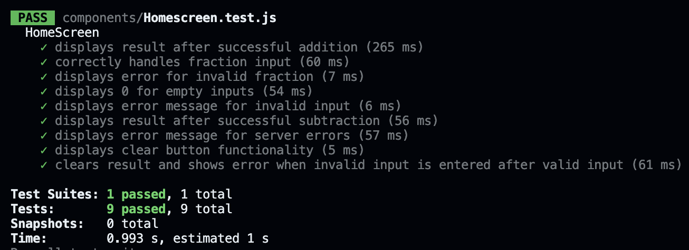

# Quickmath 


## Set Up

1. **Install dependencies**  
Run the following command to install the required dependencies:

   ```bash
   npm install

2. **Start the backend server**   
Run the backend server using Uvicorn. Make sure you're in the project directory and run the following       command:

   ```bash
   uvicorn backend.main:app --reload

3. **Open the app**   
   To open the app on the web, run the following command on a separate terminal. The app will open on http://localhost:8081.
   
        npm run web
   This app is also compatible on iOS. To open it on iOS (Xcode & Simulator required), run the following       command:
   
        npm run ios

4. **Unit testing**   
Run tests by running the following commands:

   ```bash
   npm install jest-expo
   npm test

Testing results (done with jest):

